# Arms Assembly

## Arm Assembly

This section presents the steps needed to assemble MIHA arms. They are similar between the left and right side with certain differences that the instructions will highlight. If no specific differentiation is provided, the instructions are assumed to be the same for both sides.

### Step 1

Begin by assembling the hands to a bottom of servo frame [F03](../STL/MH5-F03.stl). For left arm use the [Hand left](../STL/Hand-Left.stl), and for right arm use the [Hand right](../STL/Hand-Right.stl). Assemble them using 2 M2 screws and 2 nuts. Nuts should be positioned on the inside of the F03 frame and the screws should be placed through the two holes in the hand frames. The F03 frame should be as in the images bellow:

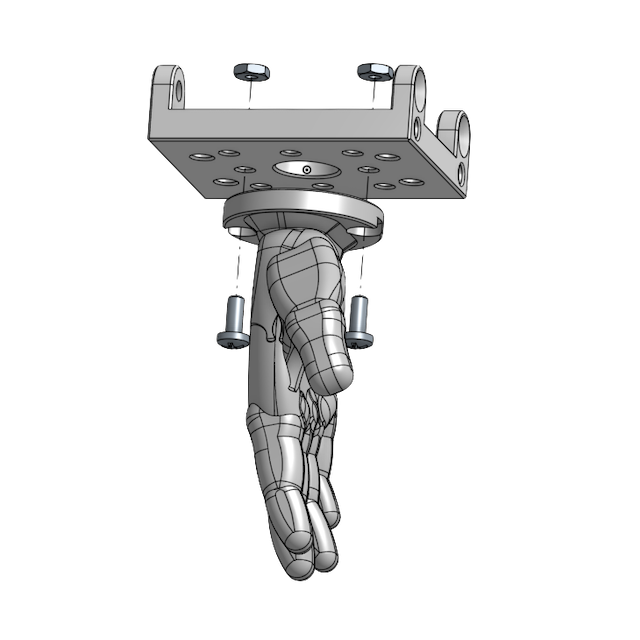

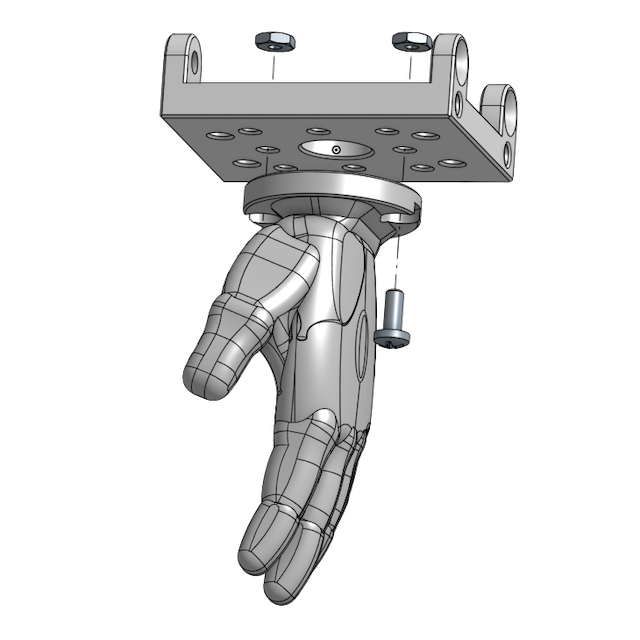

### Step 2

Take servos with ID 31 (left arm) and ID 41 (right arm) and unscrew the 4 screws that are at the bottom of the servo:

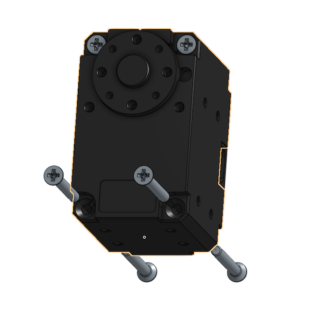

Assemble the F03 frame (with the hand) on the bottom of the servo making sure that it's oriented with the active horn on the outside of the hand (and the idle on the same side as the palm of the hand). Screw back the 4 screws, fixing the hand assembly on the servo.

For the left hand the orientation is the following:

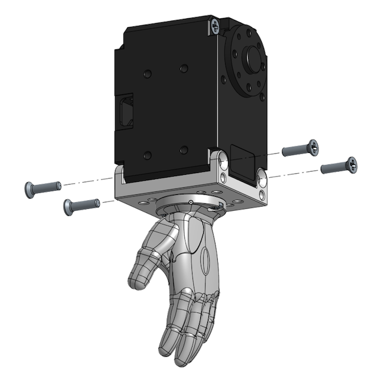

For the right hand the orientation is the following:

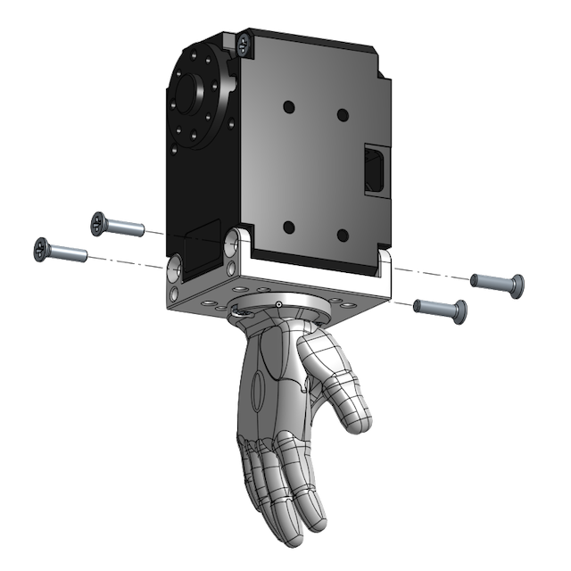

Connect an 100mm cable through the idle as explained in the [instructions](https://emanual.robotis.com/docs/en/dxl/x/xl430-w250/#idler-horn-assembly) for XL430.

### Step 3

Take an [F02 frame](../STL/MH5-F02.stl) and an [F03 frame](/STL/MH5-F03.stl) and connect them using 4 M2 screws and 4 nuts as shown in the image bellow:

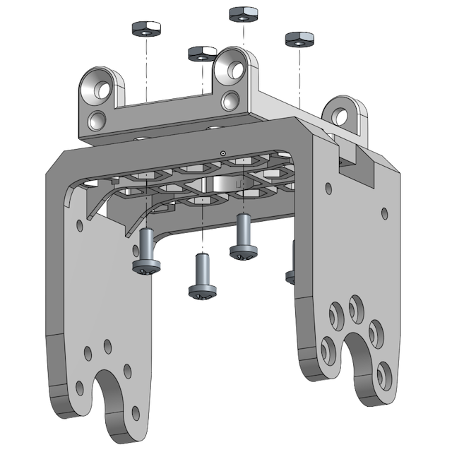

### Step 4

Take servo with ID 32(left arm) and ID 42 (right arm) and unscrew the 4 screws at the bottom, similar to Step 2. Mount the servo onto the F03 frame from the previous assembly. Screw back the 4 screws thus securing the servo onto the arm assembly.

Use a [F03](../STL/MH5-F03.stl) frame and assemble it on the horn of the new servo using 4 M2x5 screws as shown in the image bellow.

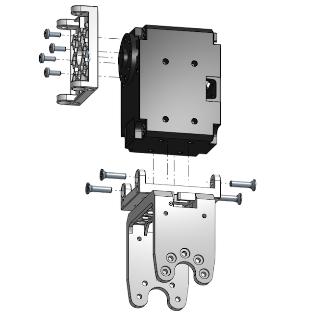

### Step 5

Take servo ID 33 (left arm) or ID 43 (right arm) and unscrew the 4 screws at the bottom, as before. Place the servo over the F03 frame that was assembled on the horn of the servo ID (32/42) making sure that the front of the servo (the active horn) is facing forward. Screw back the 4 screws, thus securing the servo in place.

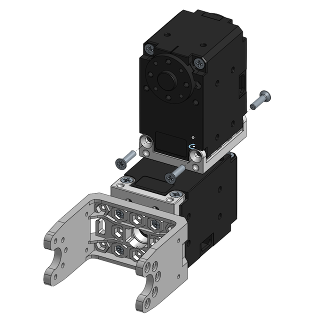

Remove the cover on the back of both servos and connect a 100mm cable from the lower servo (ID 32/42) to the upper servo (ID 33/43) using the connectors on the outside of the arm: for left arm use the connectors on the right as seen in the image above, for right arm use the connectors on the left.

### Step 6

Assemble the lower part of the arm (with the hand) onto the elbow assembly. The horn of the servo 31/41 will be oriented towards the outside of the arm and the palm should face the inside of it.

For left arm the assembly will be like this:

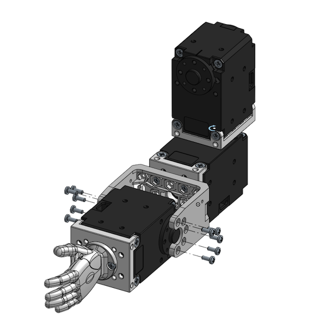

And for the right arm:

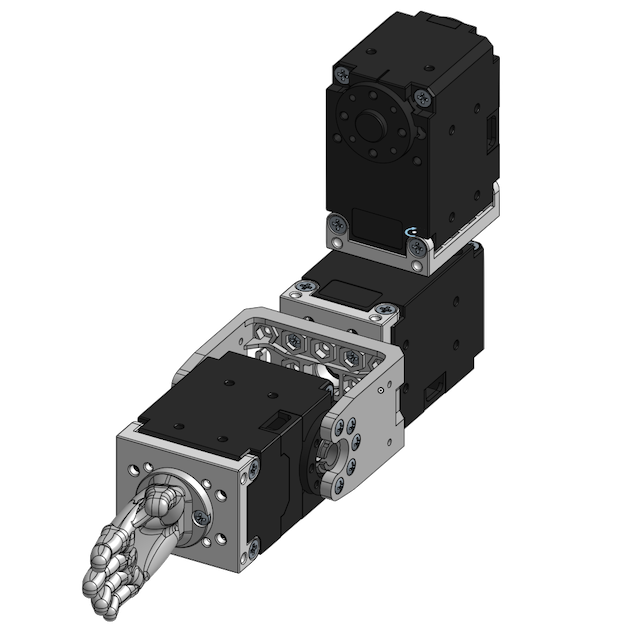

Take the second end of the short 100mm cable you installed at Step 2 on the servo ID 31/41 and connect it to the servo ID 32/42 on the same side (should be on the inside of the arm). Route the cable through the clamp that is provided in the frame F03 placing one cable at a time and following the order of the cables so that they are aligned naturally. You can now replace the cover over the connectors for the servo ID 32/42.

### Step 7

Take the servo 34 (left arm) or 44 (right arm) and a frame [F04 Frame](/STL/MH5-F04.stl) and assemble it using 4 M2 screws onto the horn of the servo so that the frame points downwards:

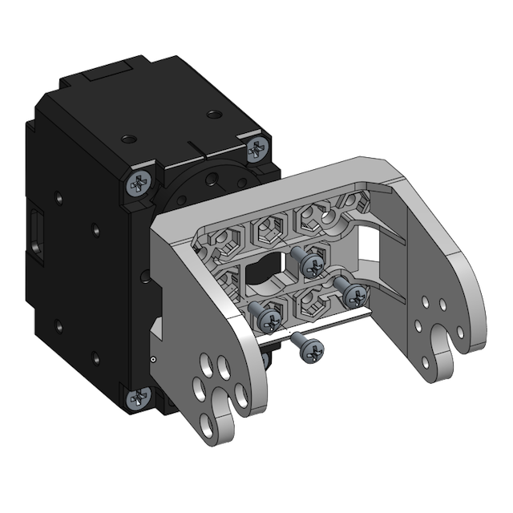!

### Step 8

Connect an 180mm cable through the horn of the servo ID 33/43 and replace the cable cover on this servo.

Then assemble the shoulder with the rest of the arm paying attention to the orientation of the arm using 5 screws on the active horn side and 5 on the idle side. For left arm the position of the subassemblies if the following:

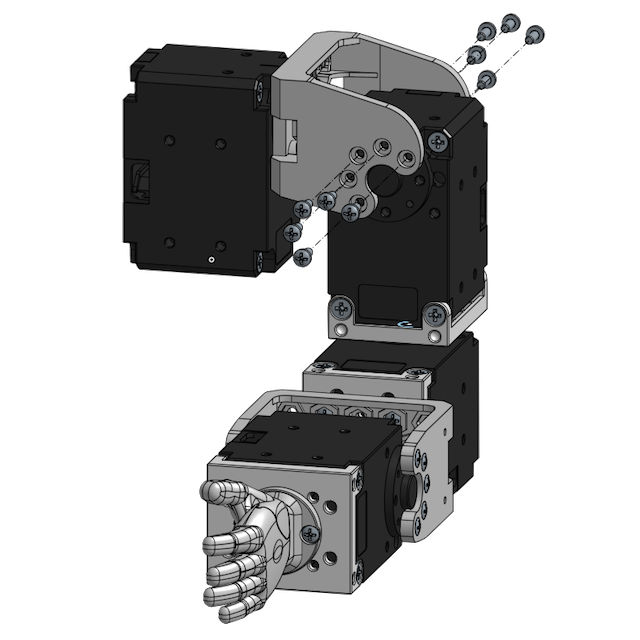

For the right arm the final positioning will be like:

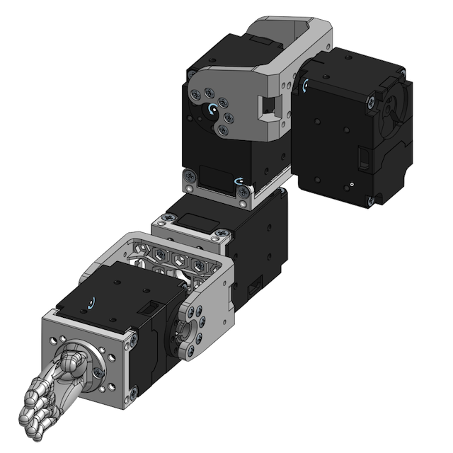

Connect the cable from the servo ID 33/43 to the servo ID 34/44 using the connector towards the back (opposite in respect to how the hand is pointing). You do not need to route the cable any specific way. Connect a short 100mm cable from the remaining connector of ID 34/44 (this will connect to the HAT board) and replace the cable cover.
