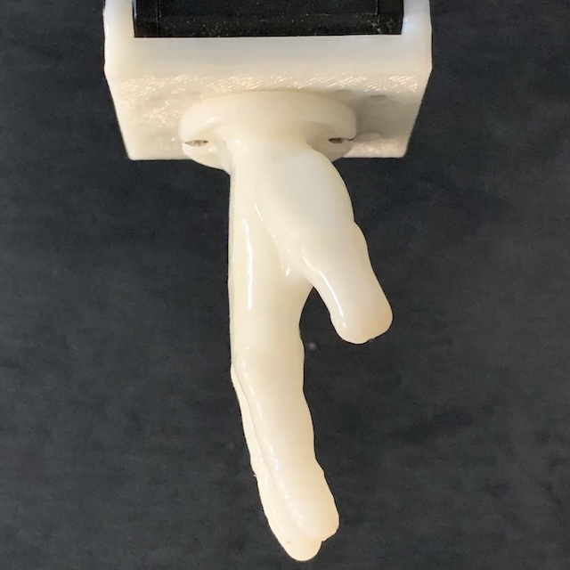
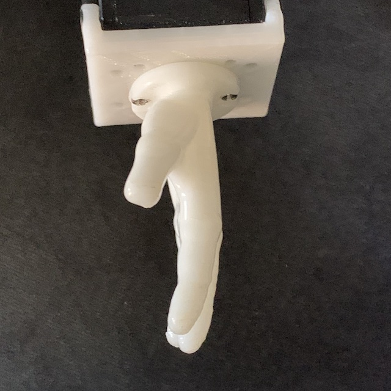
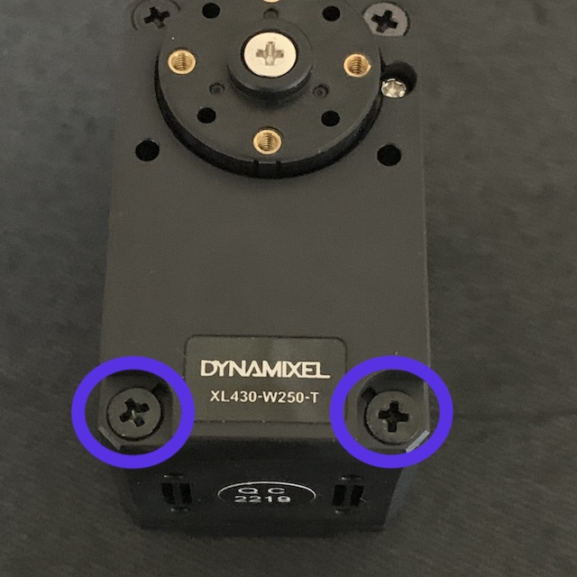
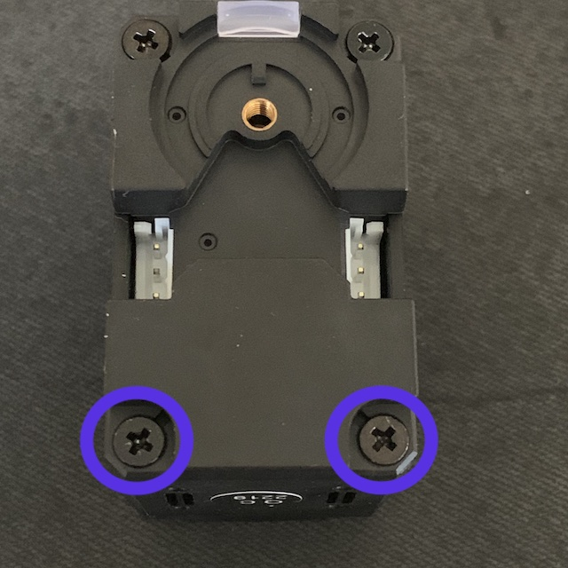
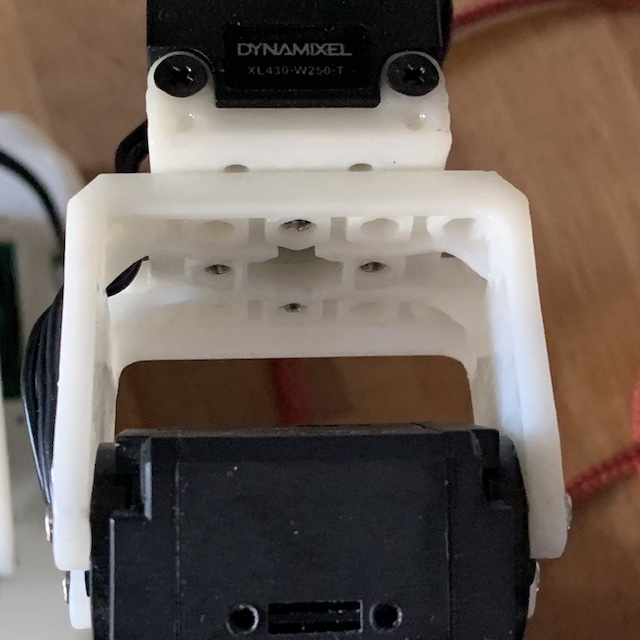
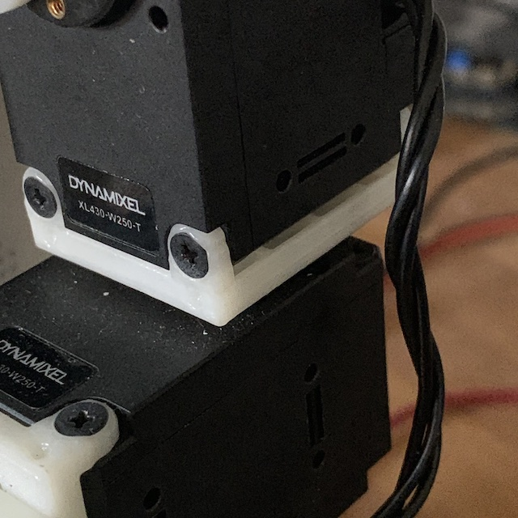
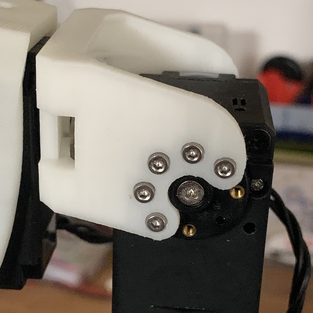

# Arms Assembly

## Arm Assembly

This section presents the steps needed to assemble MIHA arms. They are similar between the left and right side and the instructions will specify these differences, if applicable. If no specification is provided, the instructions are assumed to be the same for both sides.

### Step 1

Begin by assembling the hands to a bottom of servo frame [F03](../STL/MH5-F03.stl). For left arm use the [Hand left](../STL/Hand-Left.stl), and for right arm use the [Hand right](../STL/Hand-Right.stl). Assemble them using 2 M2 screws and 2 nuts. Nuts should be positioned on the inside of the F03 frame and the screws should be placed through the two holes in the hand frames. The F03 frame should be as in the image bellow:

 

### Step 2

Take servos with ID 31 (left arm) and ID 41 (right arm) and unscrew the 4 screws that are at the bottom of the servo:

 

Assemble the F03 frame (with the hand) on the bottom of the servo making sure that it's oriented with the active horn on the outside of the hand (and the idle on the same side as the palm of the hand). Screw back the 4 screws, fixing the hand assembly on the servo.

Connect an 100mm cable through the idle as explained in the [instructions](https://emanual.robotis.com/docs/en/dxl/x/xl430-w250/#idler-horn-assembly) for XL430. Your assembly should look tike this:

### Step 3

Take an [F02 frame](../STL/MH5-F02.stl) and an [F03 frame](/STL/MH5-F03.stl) and connect them using 4 M2 screws and 4 nuts as shown in the image bellow:

Place the middle arm assembly onto the servo from previous step. Secure it with 5 M2 screws on the active horn side and 5 M2 screws on the idle horn side. Guide the cable from the servo through the clip in the F02 frame, placing one wire at a time.

### Step 4

Take servo with ID 32(left arm) and ID 42 (right arm) and unscrew the 4 screws at the bottom, similar to Step 2. Mount the servo onto the F03 frame from the previous assembly making sure that the cafe of the servo (the one with the active horn) is towards the front (facing the thumb of the hand). Screw back the 4 screws thus securing the servo onto the arm assembly.

Remove the cover over the connectors from the back of the servo and connect the cable from the earlier servo to the connector that is on the same side. Connect another 100mm cable in the other connector of the new servo and replace the cover.

### Step 5

Mount a new [F03](/stl/MH5-F03.stl) frame onto the horn of the servo 32 (left arm) or 42 (right arm) paying attention to the orientation of the frame:

### Step 6

Take servo ID 33 (left arm) or ID 43 (right arm) and unscrew the 4 screws at the bottom, as before. Place the servo over the F03 frame making sure that the front of the servo (the active horn) is facing forward. Screw back the 4 screws, thus securing the servo in place.

Remove the cover on the back of the servo and connect the cable from the lower servo to the same side connector. Use a new 180mm cable to connect through the idle of the servo ID 33 (43 for right arm) and then replace the cover.

### Step 7

Take the servo 34 (left arm) or 44 (right arm) and a frame [F04 Frame](/STL/MH5-F04.stl) and assemble it using 4 M2 screws onto the horn of the servo so that the frame points downwards:

### Step 8

Connect the F04 frame from step 7 to the servo 33 (43). For the left arm the F04 and the servo 34 would be toward left when seen from the front of the arm and for the right arm the frame F04 and the servo 44 would be towards the right.

Use 5 M2 screws to fasten the active horn on the frame and another 5 for the idle on the back side.

### Step 9

Remove the cover from the servo 34 (44) and connect the cable from the previous servo using the connector on the same side. Use a 100mm cable for the second connector on the servo 34 (44) and replace the cover.

## Arm Review

This concludes the assembly of arms. When complete they should look like the following:

