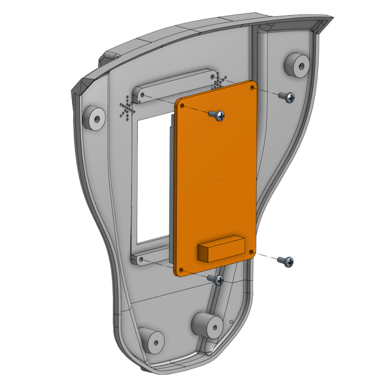

# Full Assembly

After you have finished with the assembly of the [legs](assembly-legs.md), [arms](assembly-arms.md) and [torso](assembly-torso.md) you can now finalize the assembly by putting it all together and finishing the remaining tasks.

## Arms Assembly

### Step 1

Take the right arm and place it over the supports in the torso. Make sure that the long Dynamixel cable that runs from the lower connector in Servo ID 31 to the shoulder servo ID 32 is routed between the lower supports and the edge of the torso frame. Use 8 M2.6 self-tap screws (black) to secure the servo in position: 2 on the top, 2 on the bottom and 4 on the back. The screws should make their way into the plastic case of the servo and provide additional strength to the torso frame.

### Step 2

Repeat the process above with the right arm:

You can now connect the two short Dynamixel cables from the shoulder servos to the second and third connectors in the HAT board (the first connector is used by the cable coming from the head servo). It doesn't matter which way they are connected.

## Legs Assembly

### Step 3

Take the left leg assembly and place it in the hip frame. Use 5 M2x5mm screws to connect the horn and another 5 to connect the idle on the back. The servo should be vertical when connected to the frame.

### Step 4

Repeat the steps for the right leg and secure it in position with 5 M2x5mm screws in the front and 5 in the back.

You should now take the long Dynamixel cables coming out of the idles of the top hip joints and route them through the holes that are in the lower side of the torso. Carefully pull the cables towards the frond between the speakers and the fan on either side. Then connect the cables to the lower two connectors in the HAT board.

## Front Assembly

### Step 5

Place the [2.4 inch TFT display](https://www.waveshare.com/product/displays/lcd-oled/lcd-oled-3/2.4inch-lcd-module.htm) on the [front frame](../STL/Front.stl) positioning it with the JST connector down. Use 4 sepf-tap M2 screws to secure the display in position.

### Step 6

Connect the display cable from the HAT board to the display and then place the front over the chest and using 2 M2.5 self-tap screws fix the chest onto the holes in the hip servos.

## Head Assembly

### Step 7

The final step is to place the [head back](../STL/Head-Back.stl) onto the front head and to fix it in position with 3 M2.5 self-tap screws.

This concludes the assembly of the MH5 robot. Before starting to use the robot you should perform a check of the robot assembly. This check makes sure that the servos are configured correctly and mounted in the correct position without activating them and thus risking commands that would put the motors or frames at risk.
