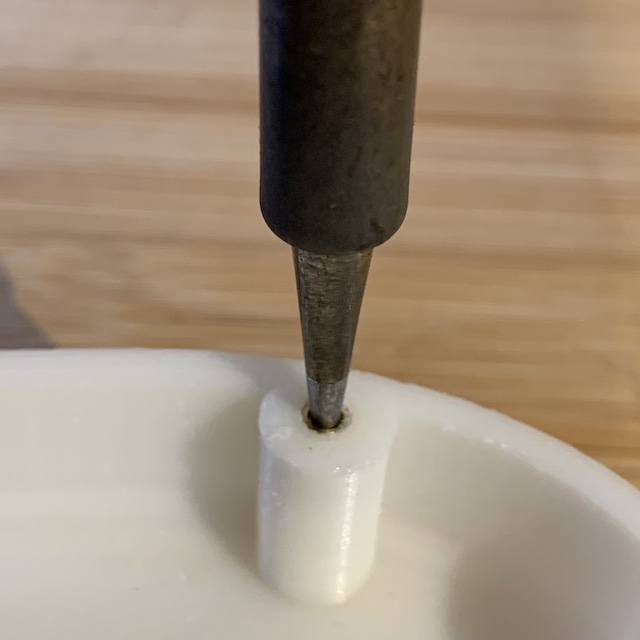

# Heat Serts

Some of the assemblies in MH5 use brass heat-serts that need to be securely inserted in the 3D printed parts. The following list shows these parts and the number of heat-serts needed:

* upper part of the foot [Foot-Top.stl](../STL/Foot-Top.stl) uses 4 heat serts for fastening of the sole
* ankle braket [Ankle.stl](../STL/Ankle.stl) uses 3 heat serts for each bracket (there are 2 brakets for each foot)
* neck [Neck.stl](../STL/Neck.stl) uses 3 heat serts for fastening to the cheast

All heat-serts are M2x3.9mm, and they have a recommended 3.1mm mounting hole.

They are pressed into the 3D printed parts using a normal soldering iron with temperature control. Chose a relatively large conic tip that will fit snugly the heat sert:

The idea is that the tip should enter relatively easy into the threaded insert, but provide enough friction so that it stays on the tip when held vertically:

Make sure that the tip is clean of any solder or flux. Start the soldering station and set the temperature to 150 degrees Celsius. You might have to experiment with the temperature setting depending on the characteristics of the material the 3D print used. In principle you want a temperature high enough that the plastic becomes slightly malleable, but low enough not excessively melt the part and distort it. The right temperature is reached when you wil feel the insert finding its way into the part with just a slight degree of pressure and without producing any warping of the surrounding walls of the 3D printed part.

Once the tip has reached the desired temperature, use some tweezers to place a heat sert on the tip and then, keeping the soldering iron as vertical as possible align it with the hole in the 3D part:

Wait about 10-15 seconds so that the hear-sert is hot and the plastic starts to soften, then apply a small amount of pressure to insert it. If you can't lower the brass insert or you must apply too much force, it means the temperature is too low. Increase it by 5-10 degrees and after waiting for a little bit to be transmitted to the parts, try again to insert the heat-sert. If you hear hissing noises, see fumes or the plastic starts to melt around the heat-sert, the temperature is too high. Reduce it by 10 degrees, wait for the tip to reduce it's temperature and try again.

You should push the heat-sert all the way in the mounting hole and then an extra 0.5-1mm bellow the top of the hole. This is needed, because when you will pull up the solder tip, the heat-serts will tend to bounce back slightly.

During the pressing of the heat-sert make sure the the soldering iron is as vertical as possible. If you notice any deviation you can re-align the insert by over-compensating the position of the soldering iron and gently re-orient the brass insert.

Once the part is placed fully in the hole, lift the soldering iron and let the parts cool down. If you want you can continue inserting the other parts. Once cooled down inspect the joint and make sure that you flatten any possible burrs that might be produced by the heat-sert making its way into the plastic by using some sand paper or a file. Is it very important that the top of the hole is perfectly flat so that when fastened with the other parts there are no gaps or untrue surfaces.

You should also test that an M2 screw fits comfortably into the heat-sert and that there are no obstructions on the thread produced by the melting plastic. Sometimes the bottom of the hole might include some molten plastic that stops the screw for screwing in the desired length (in general most screws need only 3 to 3.5mm to screw in and you should not have these types of issues). In this case you can use a 1.5mm drill bit to carefully remove the plastic on the bottom of the hole, making sure that it is perfectly parallel with the insert and that you do not damage the thread.
