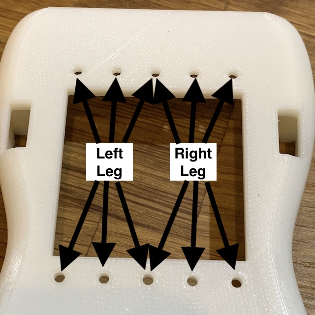

# Leg Assembly

Left and right legs are identical with the exception of the way the ankle frames are fixed to the upper foot. Therefore the explanations bellow should be assumed to apply for both legs except for those cases when explicit instructions are given for left and right leg separately.

> **Note:**
>
> To avoid any confusions, *left* and *right* are used to refer to the part of robot from its own point of view and not from the point of view of the external observer (left leg is not the leg that we see on the left side when looking at the robot, but the leg that the robot will consider at hers left leg).

## Foot assembly

### Step 1

Install 4 heat-serts into the [Foot Top](/STL/Foot-Top.stl) as described in the the [Heat-serts](assembly-heatserts.md) section.

### Step 2

Install 3 heart-serts in each of the 2 [Ankle Brackets](/STL/Ankle.stl) that we use for each foot.

### Step 3

Install the magnets in the [Foot Back](/STL/Foot-Back.stl) and [Foot Top](/STL/Foot-Top.stl). They are installed by glueing with superglue but you have to pay attention to the orientation of the magnets so that the backs fit properly and can be swapped if necessarily:

* take one of the foot back parts and place a single drop of superglue in one of the magnet supports. Using tweezers place a magnet in the support paying attention to the orientation: the smallest side (2mm) should be positioned facing up and the 3mm side should be facing towards you in the picture:

Once the glue is dried, place another magnet on the one that is already glued. It will orient itself correctly to the already glued one, but make sure that is aligned correctly with the 3mm side facing you:

Place the Foot Top upside down and test how the magnet will be positioned:

If you're happy with the placement and orientation of the magnet, remove them from the Foot Top, then place a single drop of superglue in the Foot Top magnet holder and quickly re-apply the magnets as in the picture above, but this time with a very fast movement slide the Back Cover forward while holding the magnet that needs to be glued on the Foot Top with your thumb:

This should keep the magnet in place and ensure that they are positioned correctly.

Now add one more magnet on the same glued magnet on the Foot Back like in the earlier picture and, keeping the same orientation of the Back Foot part verify the placement on the other magnet position on the Foot Top:

Again, if everything is looking right, remove them from the Foot Top, place  single drop of superglue in the Foot Top magnet holder and re-apply the magnets and with a sharp movement slide the Back cover towards you this time, while holding the magnet to be glued in place with the other hand.

The last thing now is to mount the second magnet on the Foot Back. You place a new magnet on the Foot Top last placed magnet:

Put a single drop of superglue on the remaining magnet holder in the Foot Back, approach it to the magnets and, while holding the last magnet with a finger, slide the back upward.

After all the magnets are glued make sure that the back part is matching correctly with the Foot Top and that removal and re-attaching is firm.

To apply the magnets for the second foot, use the back part with the magnets that you created earlier and place a new magnet on one side then glue it with the same technique onto the new Foot Top part. Then place on the other side and glue it on the other side of the Foot Top. Make sure during this time that the Foot Back is positioned correctly in respect to the Foot Top.

When the second Foot Top has the magnets in place you can use it to glue the magnets on the second Foot Back. First place a new magnet on one of the sides of the Foot Top, then glue it on the corresponding side of the second Foot Back. The place the last magnet on the other side of the Foot Top and glue it on the remaining side of the Foot Back.

### Step 4

You can now screw the two ankle frames onto the Foot Top. The parts need to be located on the inside of the leg as shown in this picture:

The ankle frames are not perfectly straight. Instead one of the vertical faces has a draft that is supposed to be oriented towards the exterior of the foot (that is towards the front for the frame that is connected in the front and towards the back for the frame that is connected on the back). Use 3 M2 screws to fix the front ankle and 3 M2 screws to fix the back ankle frame.

### Step 5

Now place the FSR circuit board on the Foot Sole. The board should be a close fit and should sit on the margin that is specifically cut into the sole. The bumpers of from the FSR resistors should come out very slightly through the 4 large holes in the sole and the back of the circuit board should be flush with the rest of the sole on the upper side.

Using 4 M2 screws assemble the Foot Top and then Foot Sole producing the lower part of the foot. The finalized left foot will look like this:

And the right foot will be like this:

### Step 6

We will now mount the angle servo. For left leg use the servo with IDs 11 and 12, for right leg use the servo with IDs 21 and 22.

Follow the instructions about [installing cables through the idle](https://emanual.robotis.com/docs/en/dxl/x/2xl430-w250/#idler-horn-assembly) and install a 100mm cable on the side with the horn A for ID 11 (or 21 for the other leg) and an 180mm cable on the side with the horn B for ID 12 (or 22 for the right leg). Double check that both active horns are in the 0 position.

Now place the servo between the ankle frames with the active horn of ID 11 (21 for right leg) towards the front (you should see Dynamixel A towards towards the front of the foot) and the 100mm cable coming from the idle towards the back.

Use 5 M2 screws to fix the front (active horn) and then anther 5 screws to fix the idler on the back ankle.

### Step 7

Take servo with IDs 13 and 14 (23 and 24 for right leg) and install a 180mm cable through the idle for the axis B labeled with ID 14 (24 for right leg).

Take one Straight U frame [MH5-F02](../STL/MH5-F02.stl) and assemble it using 4 M2 screws onto the active horn A (ID 13 for left leg, ID 23 for right leg). Make sure that the horn is at 0 position and that in this position the F02 frame is perpendicular to the servo:

### Step 8

Double-check that the horn B of the ankle servo (the one that is still not connected) is in 0 position and place the frame F2 mounted earlier over these axis. The second axis of the knee servo should be towards the back. Use 5 screws to connect the F02 frame to the active horn of the axis B of the ankle and 5 more to connect the idle on the other side.

Slide the 180mm cable from the ankle through the lateral holes in the F02 on one side, then get the cable out on the other side of the frame. Connect it to the free connector on the knee servo.

### Step 9

Make sure that the horn for axis B of the knee servo is in position 0. We will mount the frame [F05](../STL/MH5-F05.stl) onto this axis. You will need to pay attention to the orientation as this is one of the frames that needs to be mounted in an offset position.

Place the thigh frame (F05) as shown in the bellow image. Pay attention on the position of the active horn relative to the frame. The B axis of the knee servo should show one indentation line on the edge of the horn on the upper side of the servo (right as the servo is oriented in the picture bellow. That is the indicator that the horn is at 0 posiition. Use 5 M2 screws to fasten the frame in position, then another 5 on the other side to fasten the idle horn.

Once the frame is secured in place, rotate the horn by gently turning it anti-clockwise (in the above picture) so that the thigh is oriented vertically above the rest of the leg.

### Step 10

Take the servo with IDs 15 and 16 (25 and 26 for right leg) and use an 180mm cable through the idle of axis B. Then, route the cable from the idle of the knee servo through the idle of axis A. It might be a little tricky to do this and it will help if you place the whole assembled leg horizontally on the table.

After the cables are in palace, mount the servo A axis on the thigh frame F05 so that the servo is is positioned vertically and the horn of B axis is towards the front. Secure the servo in place with 5 M2 screws on the horn side and 5 M2 screws on the idle side.

If necessary you can adjust the cable between the knee and hip by pulling some of the length through the horn idle to reduce the amount of cable that is on the side of the thigh frame.

Finally use a cable clip on the side of the thigh to keep the cable for interfering with the frame movements.

This concludes the construction of the legs. Once completed the two legs would look like this:

