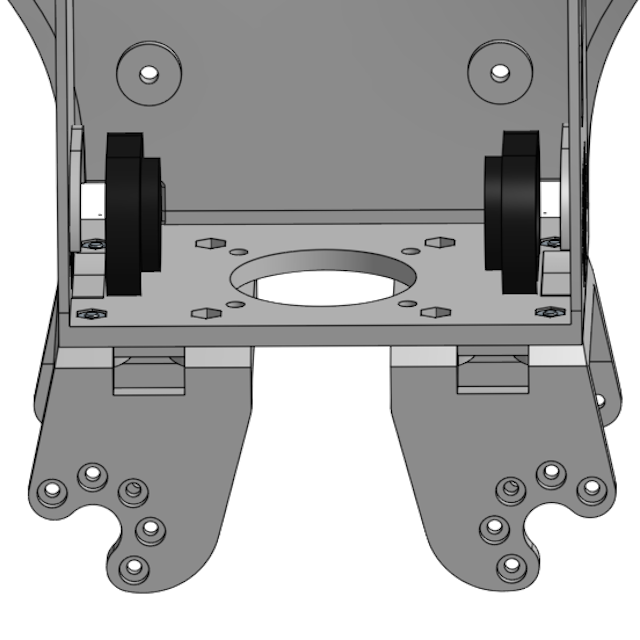

# Torso and Head Assembly

Torso and head are assembled together. For these parts the electronic components (cameras, Raspberry Pi, HAT, etc.) also play and important role and you should pay attention at the order of assembly as some electronic components are difficult to install if the order is not followed.

## Head assembly

### Step 1

First install 3 heat-serts into the [neck frame](../STL/Neck.stl) as shown in the following figure, following the instructions about [inserting the heat-serts](./assembly-heatserts.md):

### Step 2

Use the neck servo with IDs 51/52 and assemble an idle on the Axle B (52). You do not need to assemble an idle on the Axis A (51) and you do not need to mount a cable through the idle. For this servo there will be one cable only and this will be mounted freely into the connector a little bit later.

Use 4 M2x5 screws to mount the horn of Axis A (51) onto the top of the neck frame, making sure that the servo is positioned as in the figure with the Axis B towards the front of the neck. It might be a little tricky to place the screws in position, using a magnetic screwdriver would help with this task.

Use an 180mm Dynamixel cable and connect it on the side connector of the servo, then guide the cable through the middle hole of the neck and pull is towards the base of neck all the way. Make sure that there is enough cable between the whole in the neck and the servo so that the servo can move freely 90 degrees left and right without limitations.

Place the 2 [Waveshare mini cameras](https://www.waveshare.com/product/raspberry-pi/cameras/rpi-fpc-camera.htm), one at the time, through the base of the neck and using plastic tweezers pull them through the side holes in the beck, one on the left side and one on the right side. It would be helpful to note on the FPC connector which one is Left and which Right, so that you know how they will be later connected to the CSI connectors on the Cm4 carrier board.

### Step 3

Place each camera into the appropriate position in the [head front frame](../STL/Head-Front.stl) with the flat cable positioned upwards. Place over the cameras the [camera cover](../STL/Head-Camera-Cover.stl) and secure it in position with one self tap M2 screw.

### Step 4

Now place the head front over the horn and idle of the head servo Axle B and secure it in place with 5 M2x5mm screws on one side and another 5 on the other side. Use the holes in the side of the head frame to position the screwdriver in a convenient position and to be able to tighten the screws.

## Torso Assembly

### Step 5

Place the neck and front head assembly over the [chest frame](../STL/Chest.stl) and secure it with 3 M2x5mm screws. Make sure the Dynamixel cable and the two FPC camera cables are coming through the middle cutout in the chest clean without being obstructed.

### Step 6

Place 4 M2 nuts in the outer recesses in the lower plate of the chest as shown in the figure:

Then place 2 [F04](../STL/MH5-F04.stl) frames so that they point downwards and to the exterior and fix them in place with 4 M2x5mm screws against the nuts that you installed earlier:

### Step 7

If you are installing speakers, then you can place them now in the designated spaces. Remove the adhesive cover from the front of the speaker and place them with the cable facing the front of the robot in the designated positions:

### Step 8

We will now mount the [4010 PWM fan](https://www.waveshare.com/fan-4010-pwm-12v.htm) in the lower part of the torso.

Insert 4 M2x20mm long screws from the hip frames (F04) upwards then place 2 M2.5 nuts (can be plastic nuts) on top to act as a spacer between the fan and the bottom of the chest frame. Then place the fan through the 4 screws orienting the cables on the rear part of the chest and with the writing facing down (this ensures that the flow of air is from the chest towards outside). Finish with 4 M2 nuts inserted in the upper recess of the fan and tighten the screws.

## Electronics

We will now assemble the electronics and connect the cameras to the CM4 carrier board.

### Step 9

First install the heat sink on the Cm4 module following the [instructions](https://www.waveshare.com/product/cm4-heatsink.htm) from the manufacturer.

Install the CM4 onto the [Waveshare IO carrier board](https://www.waveshare.com/product/raspberry-pi/boards-kits/compute-module-4-cat/cm4-io-base-b.htm). Add a WiFi USB dongle in the lower USB connector:

Place 4 M2.5x6mm male-female standoffs on the underside of the IO carrier board and screw 4 M2.5x20mm female-female standoffs on the upper side of the carrier board:

The board is ready to be inserted in the torso.

### Step 10

Carefully place the assembled IO carrier board and the CM4 into the torso making sure that:

* the fan cable is routed under the carrier board and then over the board between the USB and HDMI connector
* the WiFi dongle is aligned with the lower cutout in the top of the torso and slides inside the neck
* all cables from the neck are routed through the small notch above the second USB connector
* the 6mm standoffs are aligned with the holes in the back of the torso

Once the carrier board is secured in place connect the fan to the connector on the IO board. The fan operates 12V and connector on the carrier board only supplies 5V. Because of this the power pin (red) of the fan is separately connected to a JST EH 3 pin connector that will be connected separately on the HAT board.

Then, carefully, direct the camera flat connectors toward the two CSI connectors on the IO board and connect them. Place the cables flat over the CM4 heat-sink.

### Step 11

You can now place the MH5-HAT over the carrier board. This should be fixed with 4 M2.5x6mm (plastic) screws in the the hex standoffs.

This concludes the assembly of the torso. The final activities will be to assemble together the legs and arms onto the torso and complete the robot with the front frame and the back of the head frame. You can find these instructions in [here](assembly-full.md).