# Configuring servos

Before assembling the robot, all servos need to be configured. Because they come with the same pre-configured IDs, once connected on a chain the servos cannot be accessed because of duplicate IDs. Therefore is it very important to update the IDs of all the servos *before* they are mounted on frames and connected with the cables. In addition to IDs we will also change the communication speed and a small amount of other parameters to simplify their management after assembly in the robot.

We use two models of Robotis servos: [XL430-W250](https://emanual.robotis.com/docs/en/dxl/x/xl430-w250/) and [2XL430-W250](https://emanual.robotis.com/docs/en/dxl/x/2xl430-w250/). Logically the two servos have identical control characteristics, with the main difference that 2XL430 has a dual axis construction, behaving as two XL430 servos in one. Most of the control registers are therefore presented in duplicate, one for each axis, with a few notable exceptions that we will highlight in the following instructions.

## Connecting the servos

In order to configure the servos we will use the [DynamixelWizard2](https://emanual.robotis.com/docs/en/software/dynamixel/dynamixel_wizard2/) application provided by Robotis. The application is available for Windows, Mac and Linux operating systems and should be downloaded and installed according to the instructions provided in the link above.

To connect the servos to the computer we recommend using an interface like [U2D2](https://emanual.robotis.com/docs/en/parts/interface/u2d2/) that connects to computers using standard USB ports and provides high-speed Dynamixel ports compatible with all Robotis servos.

> **Note:**  
> U2D2 does not provide power to the servos, only data control signals. In order to power the servos being configured you need to use an external power supply and an adapter board that makes that power available over the Dynamixel bus. Our recommendation is to use the [U2D2 Power Hub](https://emanual.robotis.com/docs/en/parts/interface/u2d2_power_hub/) which pairs conveniently with the U2D2 interface. Robotis also has a [Starter Set](http://en.robotis.com/shop_en/item.php?it_id=902-0161-200) that includes the U2D2 interface, the Power Hub and a 5A 12V power supply.

When configuring the servos, you should connect only one at a time, to avoid conflicts with duplicate IDs. Theoretically, once you have configured a servo, you could add a new by daisy-chaining it to the previous one as we're setting IDs above 10 and there will not be duplicates, but frankly there is no advantage for having multiple servos connected at this stage and you should anyway avoid constructing chains of more than 6 servos as you could experience a degradation of communication performance. We recommend connecting one servo for configuration and then removing it before connecting the next servo.

To connect the servos follow the diagram below:

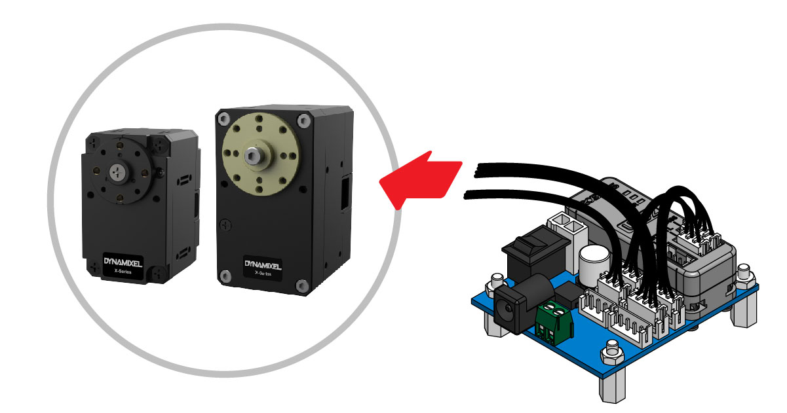

Servos have two connectors and any of them can be used to connect to the U2D2 interface.

The power supply should be connected to the DC plug on the Power Hub. The servo will indicate that has powered and is initialized successfully by short blinking the LED once. This LED should not be on continuously.

## DynamixelWizard setup

When first using the Dynamixel Wizard you will have to configure several settings like the communication port and the speed. Click the "Options" button in the toolbar:

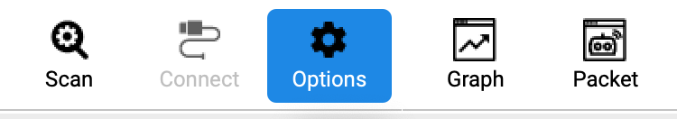

This will open the following dialog window:

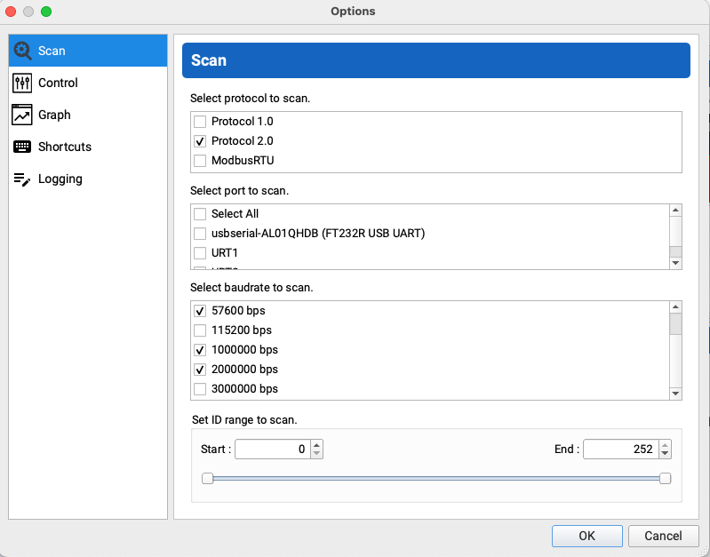

In this window we will specify the following:

* **Protocols:** we will only use Protocol 2.0 as both models of servos come pre-configured with this communication protocol. For more details on what this protocol means you can read the excellent [documentation](https://emanual.robotis.com/docs/en/dxl/protocol2/) provided by Robotis.
* **Port:** you should make sure that the port that generated when connecting the U2D2 over the USB is checked. Depending on the platform you can identify the port by simply running DynamixelWizard first without the U2D2 interface connected and then with the interface connected. The additional port that is shown when the interface is connected is the one that should be checked in the dialog.
* **Baudrate:** before configuring a servo the application needs to scan the bus and identify all the servos that are connected. Servos come pre-configured with a communication speed of 57,600 bps, so this speed should be clicked on the dialog. We will configure the servos to work at 2Mbps, so this option should also be selected in the dialog. Other speeds are not necessary and should be deselecting. Selecting additional speeds will increase the time that the application will spend to scan the bus, because it will probe for all IDs in the range (specified a little bit later in the dialog) for all communication speeds. If we are sure that we do not have to work with any other speeds we can exclude them from scanning, thus reducing the amount of time is spend during this process. If you are unsure or you have problems with servos that are not detected during scanning (for instance servos that have been used previously in other projects and were configured with other communication speeds) you can activate additional communication speeds.
* **ID range:** the new servos come with a pre-allocated number 1 for XL430 and 1 and 2 for 2XL430. We will assign IDs in the range 11 through 52 for our robot, so we could enter an interval 0 through 60 in this section to reduce the amount of time spent on scanning the bus. Similar to the comments earlier about the communication speed, if the servos have been previously used and configured with IDs higher than that you would need to extend the range to include them. If unsure, expand the range from 0 to 252 (max ID), although you will see an proportional increase in scanning time.

Once you finished updating the settings, press the "Scan" button. A progress dialog box will be displayed showing all combinations of settings used in scanning. If a servo is detected it will immediately be shown on the left side of the window, together with all the related details. For instance this is how an XL430 will be shown:

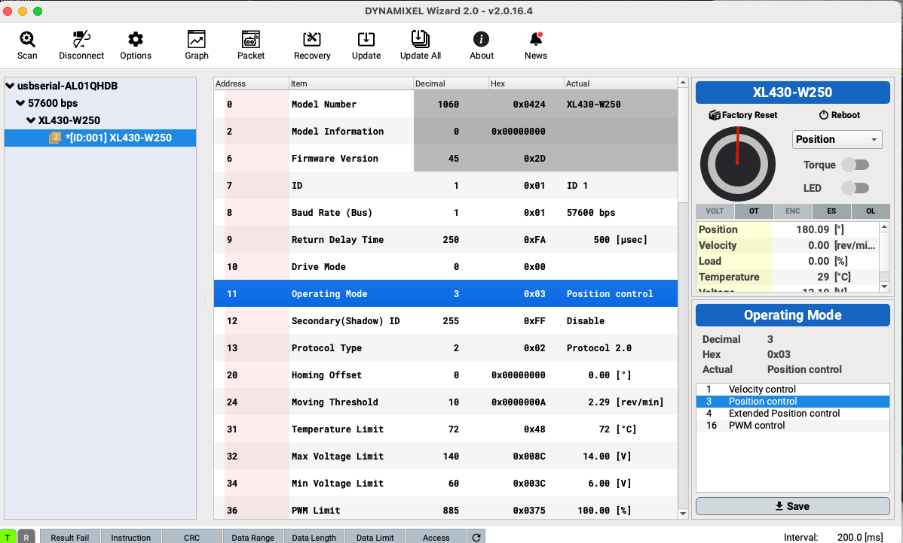

And this is an 2XL430 shown in the application. You can see that it will appear as two separate IDs:

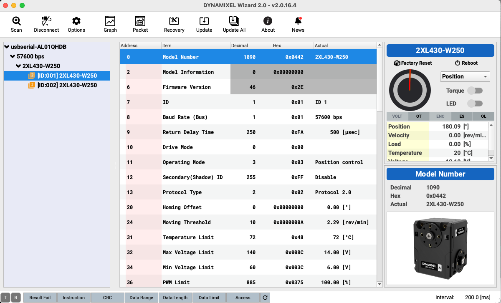

> **Note:**
> A star (*) next to the ID of a servo indicates that there is a firmware update for that device. If that is the case it is highly recommended to perform this firmware update before doing the rest of the configuration changes. You can perform this update by choosing the "Update" button in the toolbar and following the instructions:
>
> 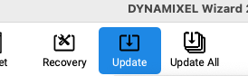

## Configuring IDs

To change the ID of a servo, select the register at address 7 called ID in the list in the center of the screen:

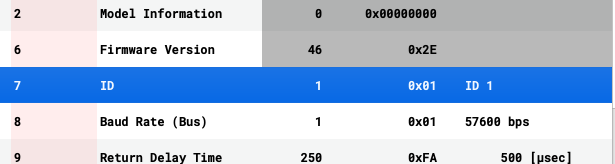

On the right side select the new ID code from the list shown. The codes to change to are listed in the section [IDs used by Miha](#ids-used-by-miha) bellow. When finished press the "Save" button:

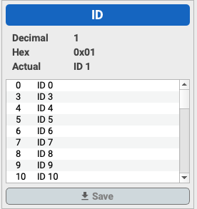

The changed ID should be immediately reflected on the left side where the devices are listed.

For 2XL430 servos you need to perform the change for each axis.

When you have finished all the configurations and remove the servo from the bus you should affix a number sticker on the servo to keep track of their numbers. You can use for example these types of stickers:

For XL430 the stickers can be applied anywhere on the body of the servo, although we recommend to place them on the bottom side as they will be less visible once the servos are integrated in with the frames. For 2XL430 servos you you will have to apply two stickers (one for each axis) and is recommended to place them on the reserved placeholders marked ID (A) and ID (B) as per the specifications of the table below. Note that the makers are exactly opposite to the horn representing that ID for this type of servos. When assembling the servos later it will be important to orient them according to the axis intended for that joint and we will use the IDs to identify the correct axis that needs to be screwed on a particular frame.

## Configuring baudrate

As mentioned earlier these servos will com pre-configured at 57,600bps communication speed. FOr a more efficient communication we will have to change the speed to 2Mbps and it is significantly easier to this at this moment, rather than later when servos are in mounted in the robot.

To change the communication speed select register with address 8 (Baud Rate):

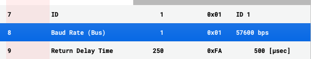

On the right side of the window the application will provide a convenient list of possible communication speeds that can be set for this device, according to the technical specs of the device. It will also conveniently convert between the internal representation of the communication speed to the clear representation in human readable form:

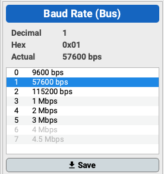

In our case select the code 4 (representing 2Mbps speed) and press "Save". The change will be immediately visible on the left tree as long as the communication speed of 2Mbps has been included in the Options as described earlier in these instructions.

For 2XL430 servos you only need to make this change for one ID and both axes will inherit this setting (it is not possible for the axes to operate at different communication speeds).

## Other configurations

If you want you can also review and update other configuration items, although these are not that critical because the initialization procedures of Miha make sure that these settings are in place when starting up the robot.

| Value | Address | Default | New | Comments |
|-------|---------|---------|-----|----------|
|Return Delay Time | 9 | 250 | 0  | This parameter configures an extra delay before servos respond to a data request. Because we're using high speed communication this delay is not needed
| Drive Mode | 10 | 0 | 0 | The default of 0 should be used, but in certain circumtances the MH5 controllers might chose to configure the servos with other drive mode
| Operating Mode | 11 | 3 | 3 | This should be 3 (Position Control)

## Making sure that every thing works fine

Before disconnecting the servo and labeling it, you should also make sure that the servo works as expected and that the assignments of IDs are as intended.

In the list of registers select "Goal Position" at address 116:

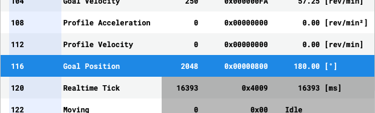

On the right side you will see a convenient interface that allows you to manually position the horn of the servo:

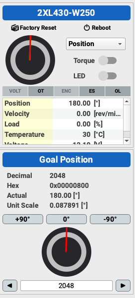

First toggle the Torque switch in the upper part of the interface. The horn should now be stiff and controllable. Use the +90 and -90 buttons to command the horn to move to the desired angles. Observe that the horn move smoothly and without any jitter. If using 2XL430 servo then also make sure that the correct horn is moving (should be the one opposite the label with the new ID assigned for that axis).

If everything is OK place the horn in the 0 position (press the 0 button) and then deactivate the torque for the servo. If using a 2XL430 repeat the process for the second ID.

## IDs used by MIHA

This section lists the IDs that need to be assigned to the servos for each joint of Miha robot. For joints that are implemented by using 2XL430 servos pay attention to the codes assigned to each axis.

<table>
    <thead>
        <tr>
            <th>Model</th>
            <th>Axis</th>
            <th>Def ID</th>
            <th>New ID</th>
            <th>Joint Code</th>
            <th>Joint Description</th>
    </thead>
    <tbody>
        <tr>
            <td rowspan=2>2XL430</td>
            <td>A</td>
            <td>1</td>
            <td>11</td>
            <td>l_ank_r</td>
            <td>Left Ankle Roll</td>
        </tr>
        <tr>
            <td>B</td>
            <td>2</td>
            <td>12</td>
            <td>l_ank_p</td>
            <td>Left Ankle Pitch</td>
        </tr>
        <tr>
            <td rowspan=2>2XL430</td>
            <td>A</td>
            <td>1</td>
            <td>13</td>
            <td>l_kne_y</td>
            <td>Left Knee Yaw</td>
        </tr>
        <tr>
            <td>B</td>
            <td>2</td>
            <td>14</td>
            <td>l_kne_p</td>
            <td>Left Knee Pitch</td>
        </tr>
        <tr>
            <td rowspan=2>2XL430</td>
            <td>A</td>
            <td>1</td>
            <td>15</td>
            <td>l_hip_p</td>
            <td>Left Hip Pitch</td>
        </tr>
        <tr>
            <td>B</td>
            <td>2</td>
            <td>16</td>
            <td>l_hip_r</td>
            <td>Left Hip Roll</td>
        </tr>
        <tr>
            <td rowspan=2>2XL430</td>
            <td>A</td>
            <td>1</td>
            <td>21</td>
            <td>r_ank_r</td>
            <td>Right Ankle Roll</td>
        </tr>
        <tr>
            <td>B</td>
            <td>2</td>
            <td>22</td>
            <td>r_ank_p</td>
            <td>Right Ankle Pitch</td>
        </tr>
        <tr>
            <td rowspan=2>2XL430</td>
            <td>A</td>
            <td>1</td>
            <td>23</td>
            <td>r_kne_y</td>
            <td>Right Knee Yaw</td>
        </tr>
        <tr>
            <td>B</td>
            <td>2</td>
            <td>24</td>
            <td>r_kne_p</td>
            <td>Right Knee Pitch</td>
        </tr>
        <tr>
            <td rowspan=2>2XL430</td>
            <td>A</td>
            <td>1</td>
            <td>25</td>
            <td>r_hip_p</td>
            <td>Right Hip Pitch</td>
        </tr>
        <tr>
            <td>B</td>
            <td>2</td>
            <td>26</td>
            <td>r_hip_r</td>
            <td>Right Hip Roll</td>
        </tr>
        <tr>
            <td>XL430</td>
            <td>-</td>
            <td>1</td>
            <td>31</td>
            <td>l_elb_p</td>
            <td>Left Elbow Pitch</td>
        </tr>
        <tr>
            <td>XL430</td>
            <td>-</td>
            <td>1</td>
            <td>32</td>
            <td>l_elb_y</td>
            <td>Left Elbow Yaw</td>
        </tr>
        <tr>
            <td>XL430</td>
            <td>-</td>
            <td>1</td>
            <td>33</td>
            <td>l_sho_r</td>
            <td>Left Shoulder Roll</td>
        </tr>
        <tr>
            <td>XL430</td>
            <td>-</td>
            <td>1</td>
            <td>34</td>
            <td>l_sho_p</td>
            <td>Left Shoulder Pitch</td>
        </tr>
        <tr>
            <td>XL430</td>
            <td>-</td>
            <td>1</td>
            <td>41</td>
            <td>r_elb_p</td>
            <td>Right Elbow Pitch</td>
        </tr>
        <tr>
            <td>XL430</td>
            <td>-</td>
            <td>1</td>
            <td>42</td>
            <td>r_elb_y</td>
            <td>Right Elbow Yaw</td>
        </tr>
        <tr>
            <td>XL430</td>
            <td>-</td>
            <td>1</td>
            <td>43</td>
            <td>r_sho_r</td>
            <td>Right Shoulder Roll</td>
        </tr>
        <tr>
            <td>XL430</td>
            <td>-</td>
            <td>1</td>
            <td>44</td>
            <td>r_sho_p</td>
            <td>Right Shoulder Pitch</td>
        </tr>
        <tr>
            <td rowspan=2>2XL430</td>
            <td>A</td>
            <td>1</td>
            <td>51</td>
            <td>head_p</td>
            <td>Head Pitch</td>
        </tr>
        <tr>
            <td>B</td>
            <td>2</td>
            <td>52</td>
            <td>head_y</td>
            <td>Head Yaw</td>
        </tr>
    </tbody>
</table>

The following picture shows the respective servos in the context of the robot:

